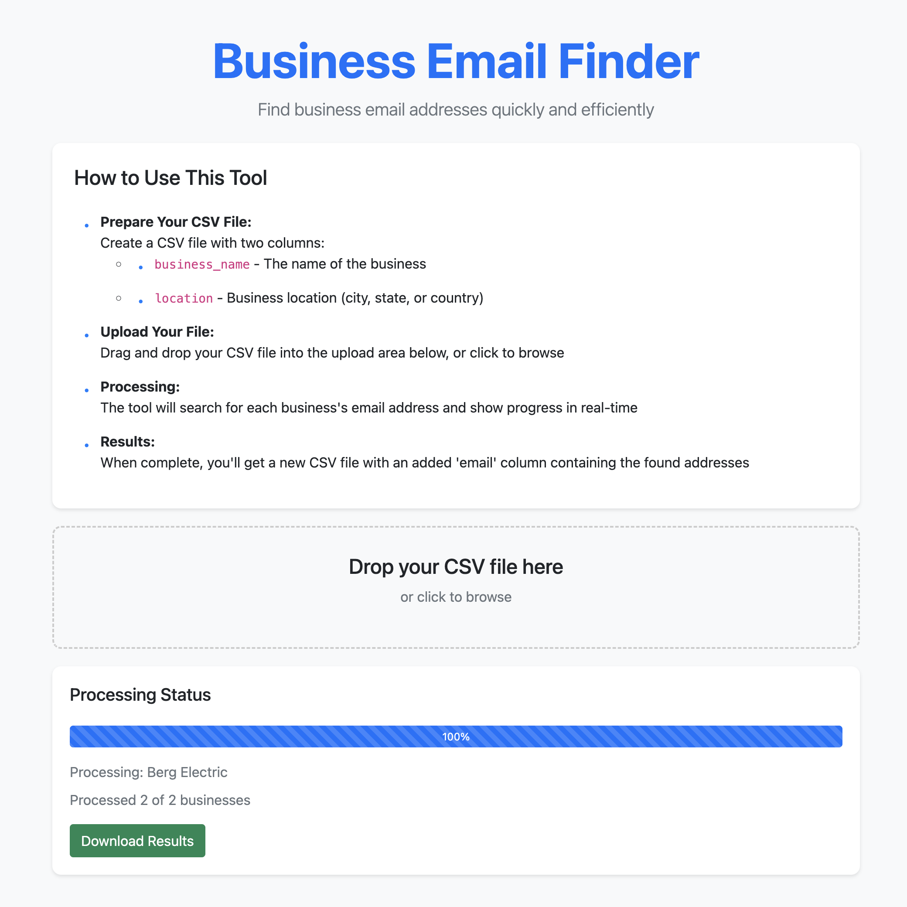
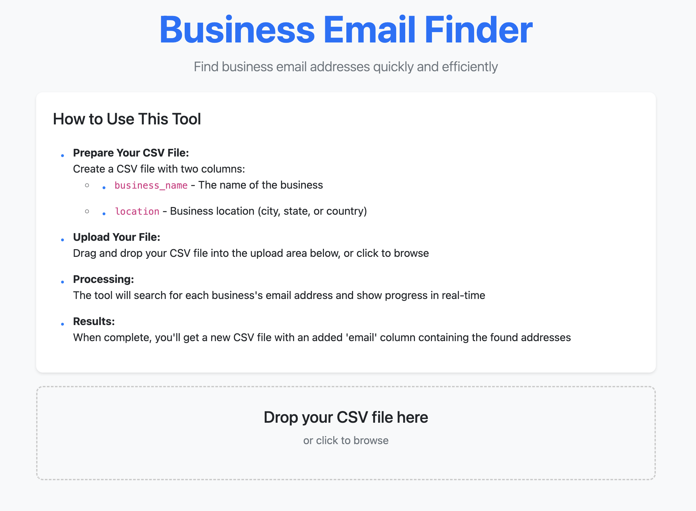

# Business Email Finder

Find business email addresses quickly and efficiently. This tool helps you find email addresses from Facebook business pages by processing a CSV file of business names and locations.

## Application Interface



## File Upload



## Installation

1. Clone this repository:
```bash
git clone https://github.com/banddude/facebook-email-scraper.git
cd facebook-email-scraper
```

2. Install required packages:
```bash
pip install -r requirements.txt
```

## Usage

1. Start the application:
```bash
python app.py
```

2. Open your browser and go to:
```
http://localhost:5001
```

## CSV Format

Input CSV format:
```csv
business_name,location
"Business Name 1","City 1"
"Business Name 2","City 2"
```

Output CSV format:
```csv
business_name,location,email
"Business Name 1","City 1","email1@example.com"
"Business Name 2","City 2","email2@example.com"
```

## Features

- Automated email finding from Facebook pages
- Progress tracking
- Handles multiple businesses
- Downloads results as CSV
- Clean web interface

## Notes

- The application uses Chrome in headless mode
- Results are saved in the 'uploads' directory
- Processing time depends on the number of businesses 